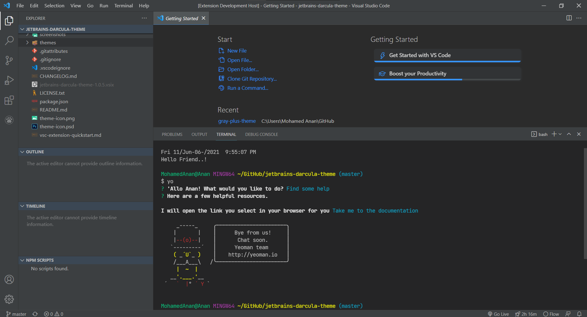

# Gray+ Theme for Visual Studio Code
[](https://vsmarketplacebadge.apphb.com/version/Anan.gray-plus-theme.svg)
[](https://vsmarketplacebadge.apphb.com/installs-short/Anan.gray-plus-theme.svg)
[](https://vsmarketplacebadge.apphb.com/downloads-short/Anan.gray-plus-theme.svg)
[](https://vsmarketplacebadge.apphb.com/rating-star/Anan.gray-plus-theme.svg)

[](http://isitmaintained.com/project/mohamed3nan/gray-plus-theme "Average time to resolve an issue")
[](http://isitmaintained.com/project/mohamed3nan/gray-plus-theme "Percentage of issues still open")


## Description
A theme extension for Visual Studio Code based on Drak+ (default dark) Syntax but with Gray UI.

## Installation
Launch VS Code Quick Open (Ctrl+P), paste the following command, and press enter.

```ext install anan.gray-plus-theme```

or:

[Download from VisualStudio Marketplace](https://marketplace.visualstudio.com/items?itemName=Anan.gray-plus-theme)

## Screenshot


## Tweaks & theming
If you want to play around with new colors, use the setting
`workbench.colorCustomizations` to customize the currently selected theme. For
example, you can add this snippet in your "settings.json" file:

```json
"workbench.colorCustomizations": {
  "tab.activeBackground": "#282c34",
  "activityBar.background": "#282c34",
  "sideBar.background": "#282c34"
}
```

or use the setting `editor.tokenColorCustomizations`

```json
"editor.tokenColorCustomizations": {
  "[Gray+]": {
    "textMateRules": [
      {
        "scope": ["source.python"],
        "settings": {
          "foreground": "#e06c75"
        }
      }
    ]
  }
}
```
Please check the official documentation,
[Theme Color Reference](https://code.visualstudio.com/docs/getstarted/theme-color-reference) and
[Theme Color](https://code.visualstudio.com/docs/getstarted/themes), for more helpful information.

[More info](https://code.visualstudio.com/updates/v1_15#_user-definable-syntax-highlighting-colors)


## Contribution
Feel free to make a pull request or open a new issue.


## Resources
- [VS Code](https://github.com/microsoft/vscode/tree/main/extensions/theme-defaults/themes)


## Changelog
[CHANGELOG](CHANGELOG.md)


## License
This project is licensed under the MIT License - see the
[MIT](LICENSE.txt) file for details.


---

**Enjoy!**
